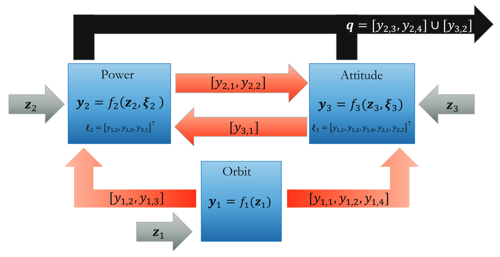
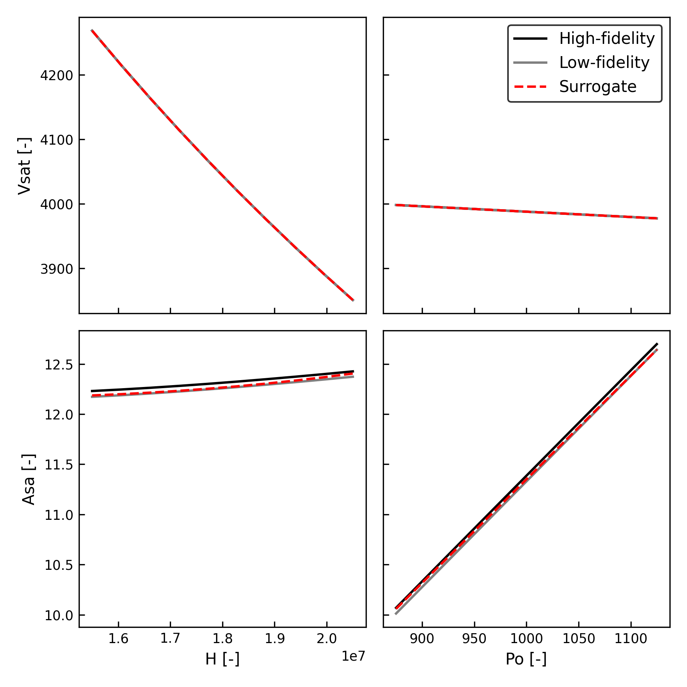

## Two component system
Here is a simple example of a two-component multidisciplinary system.
```python
--8<-- "amisc/examples/tutorial.py:simple"
```
The first component computes $y=x\sin(\pi x)$. The second component takes the output of the first and computes $z=1 / (1 + 25y^2)$. Note that we must specify the domains of the variables over which we wish to build the surrogate (here they are just set to (0, 1)).

## Random variable
Here is an example of interpolating a function of a random variable $x\sim U(-1, 1)$. We manually construct the `Variable` and assign it a PDF. Then, we define the `Component` model and its inputs and outputs. Finally, we construct the MD system (which has just one component) and train the surrogate. 
```python
--8<-- "amisc/examples/tutorial.py:single"
```
Note, the `data_fidelity` parameter sets the maximum refinement level for the surrogate.

## Fire detection satellite
Here is an example of a three-component fire detection satellite system from [Chauduri (2018)](https://dspace.mit.edu/handle/1721.1/117036):

We define the system in a yaml configuration file and load the `System` object using a helper function (see the source code for details). Since the fire-sat system has complicated couplings between models, we generate a test set and estimate the coupling variable bounds while training the surrogate. Finally, we plot some diagnostics to determine the performance of the surrogate.
```python
--8<-- "amisc/examples/tutorial.py:fire_sat"
```
Here is the output of `plot_slice()`:

We see that the model has a smooth response over the inputs, and our surrogate is able to accurately approximate the high-fidelity model.

## Field quantity
A field quantity is specified as a `Variable` (just like a scalar), except it is given a `Compression` map that tells `amisc` how to reduce the field quantity to a set of "latent" coefficients over which to build the surrogate approximation. This would be desirable if you want to approximate the output of a high-dimensional solution, for example, from a PDE mesh.

In this example, we generate a random data matrix to simulate a high-dimensional field quantity, and construct a rank-4 SVD compression map. Note, we must provide the coordinates (Cartesian or otherwise) on which the field quantity is defined. We then approximate the field quantity as a function of the `x` scalar input.
```python
--8<-- "amisc/examples/tutorial.py:field_qty"
```
Note that the surrogate will predict the field quantity in its "latent" or compressed space. To obtain the full field quantity, we must reconstruct the field using the inverse of the compression map (which is stored in the `field_qty` variable). The `to_model_dataset` utility provided by `amisc` will do this for you.