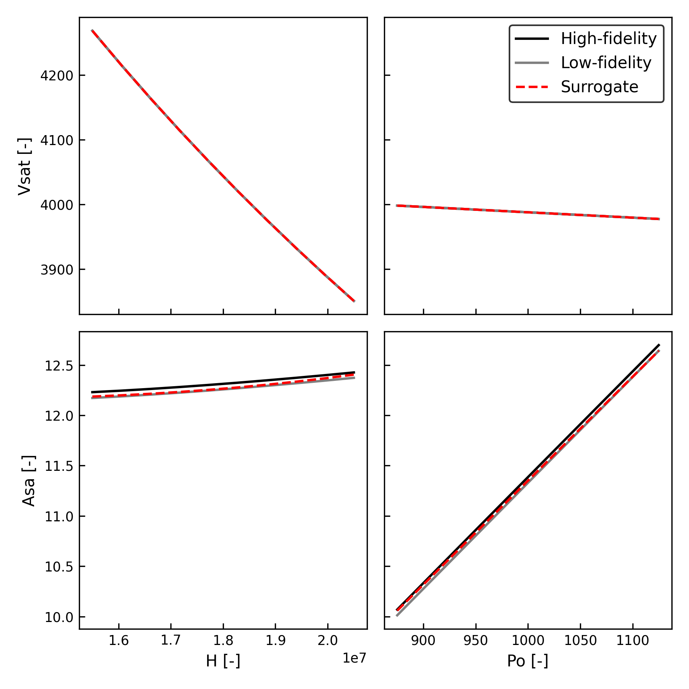

## Single component example
Here is an example of interpolating a simple quadratic function.
```python title="amisc.examples.tutorial.py"
--8<-- "amisc/examples/tutorial.py:single"
```

## Two component system
Here is a simple example of a two-component multidisciplinary system.
```python title="amisc.examples.tutorial.py"
--8<-- "amisc/examples/tutorial.py:simple"
```
The first component computes $y=x\sin(\pi x)$. The second component takes the output of the first and computes
$z=1 / (1 + 25y^2)$. The system-level input is $x$ and the system-level outputs are $y$ and $z$. 

!!! Note
    Each component always locally returns a dictionary with the output saved as `y=value`. This is not to be confused with the 
    _system-level_ `y` variable in this example.

## Fire detection satellite
Here is an example of a three-component fire detection satellite system from [Chauduri (2018)](https://dspace.mit.edu/handle/1721.1/117036).
```python title="amisc.examples.tutorial.py"
--8<-- "amisc/examples/tutorial.py:fire_sat"
```
We first generate a test set using the ground truth model predictions (and filter any bad values out). Then we train the 
surrogate in 10 iterations, and finally plot some results. Here is the output of `plot_slice()`:
